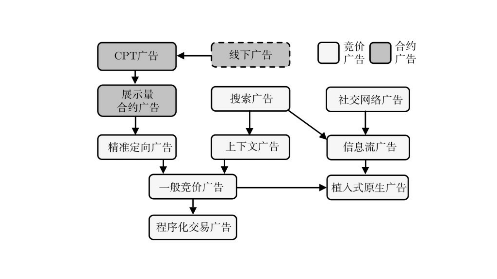
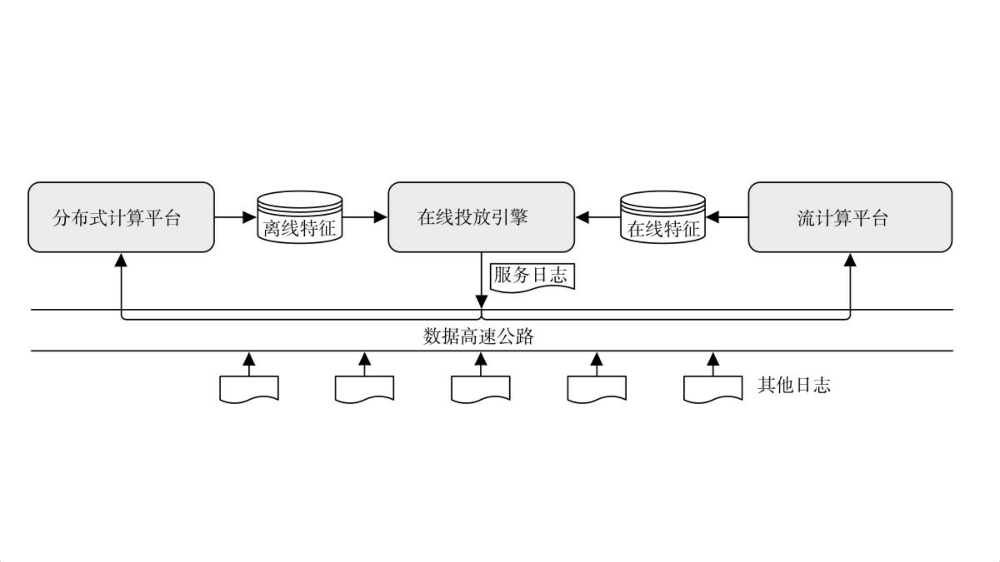
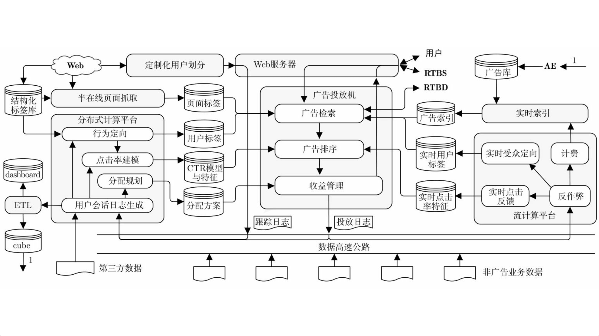
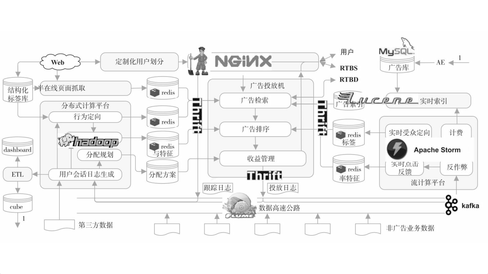

###### 广告效果的阶段

曝光-关注-理解-接受-保持-决策

###### 广告的演进

|         | 受众端形式               | 定向方式                | 收费方式       | 提升之处                                 |
| ------- | ------------------- | ------------------- | ---------- | ------------------------------------ |
| CPT广告   | 不限                  | 简单定向：时段、地理          | CPT按展示时间收费 |                                      |
| 展示量广告   | 不限                  | 简单定向：时段、地理          | CPM按照曝光量收费 | 按照曝光量收费，广告开始向“面向效果”方向进化              |
| 搜索广告    | 搜索结果页：结果列表/页面其他位置   | 中级定向：关键词            | 竞价单价+点击量   | 关键词提供更好的定向方式                         |
| 社交网络广告  | 不限                  | 简单定向：时段、地理          | 不限         | 用户在社交网络停留时间更久，适合持续曝光                 |
| 精准定向广告  | 不限                  | 高级定向：用户信息，频道定向      | 竞价单价X点击量   | 从“数量”->“质量”                          |
| 上下文广告   | 不限                  | 高级定向：页面内容、行为信息、用户信息 | 竞价单价X点击量   | 不在依赖单一的关键词，分析页面内容能够提供更多的信息来帮助定向      |
| 信息流广告   | 通常在阅读信息流中，和用户消费内容相似 | 高级定向                | 竞价单机+点击量   | 开始尝试将内容和广告融合。增强广告曝光，同时也降低了广告对用户体验的伤害 |
| 一般竞价广告  | 不限                  | 高级定向                | 竞价单价+点击量   | 能使用多种信息进行复杂定向，整合多种媒体多种广告形式。          |
| 植入式原生广告 | 融入产品内容/服务           | 高级定向                | 竞价单机+点击    | 广告和内容更加深度融合                          |
| 程序化交易广告 | 不限                  | 高级定向                | 实时竞价单价+点击  | 实时竞价，进一步提高广告效果转化效率                   |

以上我们可以看到，

互联网广告系统发展有两个方向：1、开发新广告资源，如信息流广告和植入广告；2、提高广告转化效率、如定向技术上的提升；3、定价机制

互联网广告系统发展的终极目标是“价值最大化”，广告系统价值  = 广告转化效率 * 单次广告价值  * 广告资源量

- 广告转化效率： 主要体现在1、提高广告与受众的匹配度，精确投放；2、提高广告接受度，如信息流广告/植入广告。
- 单位广告价值：竞价广告，能够实现将广告资源分配给能够让广告资源发挥更大价值的广告主，实现单位广告资源价值的最大化。“单位” 不断细化，也导致了能够实时竞价的程序化交易广告的出现 
- 广告资源量：如何在保证一定用户体验水平的基础上，尽可能获得更多广告资源。信息流广告，植入广告的出现增加了产品的可用广告资源量

产品架构

###### 技术架构

high level

- 广告投放引擎
  - 广告投放机
  - 广告检索
  - 广告排序
  - 收益管理
  - 广告请求接口
  - 定制化用户划分
- 数据高速公路
- 离线数据处理
  - 用户会话日志生成
  - 行为定向
  - 上下文定向
  - 点击率建模
  - 分配计划
  - 商业智能
  - 广告管理系统：客户与广告系统的接口
- 在线数据处理
  - 在线反作弊
  - 计费
  - 在线行为反馈
  - 实时索引

###### 关键技术

Nginx： web服务器

ZooKeeper：分布式配置和集群管理工具 

Lucene：全文检索引擎

Thrift：跨语言通信接口

Flume：数据告诉公路

Hadoop：分布式数据处理平台

Redis：特征在线缓存

Storm：流计算平台

Spark：高校迭代计算框架。在Hadop基础上，增强了运算性能（内存运算）。但由于大数据的基础存储仍依赖Hadoop，所以还不能取而代之，Spark能够和Hadoop共享存储功能和计算资源。