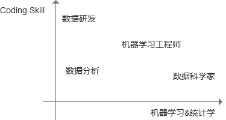

#数据科学入门

[TOC]

一直对数据科学很感兴趣，也陆陆续续学了很多东西。以下是个人觉得需要掌握的一些知识。

##1. 入门
-----
####**学习要求**
 - 掌握R、python、SAS语言（任意一种即可）
 - 掌握sql
 - ### 熟悉数据清洗，描述统计分析、可视化常用的方法
 - 了解数据开发的基本流程以及要求。
 - 能够独立完成数据研究报告

### 学习方法

#### R语言篇

 - 学习语言：相比于Python，R数据分析、数据建模的package更强大。
    - 推荐先学Roger D.Peng的 [R Programming for Data Science](https://leanpub.com/rprogramming)（免费pdf）
    - 深入了解R可以读一下官方[Mannual](https://cran.r-project.org/manuals.html)，或者官方推荐[书籍](https://www.r-project.org/doc/bib/R-books.html)
 - 开发环境：Rstudio。Rstudio的包管理，数据预览非常方便。参考（需要梯子）：[R环境安装-win](https://www.youtube.com/watch?v=Ohnk9hcxf9M&feature=youtu.be)+[R环境安装-mac](https://www.youtube.com/watch?v=uxuuWXU-7UQ&feature=youtu.be)+[Rstudio安装](https://www.youtube.com/watch?v=bM7Sfz-LADM&feature=youtu.be)。
 - 以下是学习常用的package，足以胜任对数据的统计性分析。很多书都对其中一些package进行了介绍，但更推荐使用时查看官方文档。
    - 数据获取：
        -  RODBC, RMySQL, RPostgresSQL, RSQLite - 从sql数据库获得数据
        -  XLConnect, xlsx - 获得excel数据
        -  foreign - 获得SAS数据
    - 数据操作：
        - dplyr - 最常用的数据操作功能包。subsetting, summarizing, rearranging, joining等操作
        - tidyr - 表变换。列合并，列展开操作
    - 可视化
        - ggolot2 - 最常用的数据可视化包。除了官方文档，推荐个函数速查[cheet sheet](https://www.rstudio.com/wp-content/uploads/2015/03/ggplot2-cheatsheet.pdf)

 - [swirl](http://swirlstats.com/) - “swirl teaches you R programming and data science interactively, at your own pace, and right in the R console!swirl”. swirl内置了数据集和步骤引导，值得反复练习。
 - Cousera 上的[R programing](https://www.coursera.org/learn/r-programming/home)
 - sql：掌握w3c上介绍了[sql基础知识](http://www.w3school.com.cn/sql/sql_syntax.asp)，个人关于sql的[总结](SQL_Basic.md)

----------
**其他好的学习资源**

 - Rstudio官方推荐的一些好的[packages](https://www.google.com/#q=good+package+R)。针对数据分析不同阶段给出package推荐，基本可以覆盖入门阶段需求。

#### Python篇

- 学习语言：对于有一定编程基础的同学，快速过一遍runoob上的python基础教程，了解基本语法就足够了。

- 开发环境。开发环境配置推荐使用Anaconda。[anaconda安装](http://www.jianshu.com/p/2f3be7781451)

  - > “Python 是一种强大的编程语言，其提供了很多用于科学计算的模块，常见的包括 numpy、scipy 和 matplotlib。要利用 Python 进行科学计算，就需要一一安装所需的模块， 而这些模块可能又依赖于其它的软件包或库，因而安装和使用起来相对麻烦。幸好有人 专门在做这一类事情，将科学计算所需要的模块都编译好，然后打包以发行版的形式 供用户使用，Anaconda 就是其中一个常用的科学计算发行版。”

  - anaconda中有打包了一些很赞实用的工具

    - IPython：相比于cmd，IPthon提供了一个更加方便直观的Python Shell。因为大多数情况下都用IDE，所以IPython仅用于快速执行一些命令。
    - Jupyter notebook。一个自带python运行、调试环境的python笔记本。用于记一些重要的代码片段、向他人解释程序。
    - spyder：Python数据科学IDE，最大的优点就是模仿MATLAB的“工作空间”的功能，可以很方便地观察和修改数组的值。用python搞数据的必备工具

- 常用的package，相比于python语法的学习，掌握python数据科学相关的包才是真正重要的事情

  - numpy：提供了高效的多维数据矩阵存储结构（ndarray），以及基本矩阵运算函数（ufunc）。
  - SciPy：在numpy的基础上，增加了更丰富的科学运算库函数。如微积分、线性代数等。
  - matplotlib：绘图库（吐槽一句，比与R的ggplot2难看很多）。

- 推荐动物系列的《Python for Data Analysis》，google上免费高清的英文版。此书有中文版（强烈推荐看英文版的，因为当你碰到问题需要去google的时候，你会发现用英文准确描述问题是多么重要的一件事情）

**其他好的学习资源**

[Python 网页爬虫 & 文本处理 & 科学计算 & 机器学习 & 数据挖掘兵器谱](http://python.jobbole.com/81153/)

##2. 进阶
####**学习要求**

 - 掌握数据的推论性分析、回归分析操作方法
 - 掌握相关统计学知识
    - 集中趋势：平均数， 中位数，众数
    - 总体方差、样本方差、标准差
    - 二项次分布、几何分布、泊松分布、正太分布、伯努利分布。梳理了一下[几种分布的联系和区别](各种分布之间的联系和区别.md)
    - [大数定理](https://zh.wikipedia.org/wiki/%E5%A4%A7%E6%95%B0%E5%AE%9A%E5%BE%8B)
    - 经验法则99.7%，95%，68%
    - 中心极限定理
    - [贝叶斯定理](https://zh.wikipedia.org/wiki/%E8%B4%9D%E5%8F%B6%E6%96%AF%E5%AE%9A%E7%90%86)
    - t分布，t置信区间；z和t统计量，[一型错误，二型错误](https://zh.wikipedia.org/wiki/%E7%AC%AC%E4%B8%80%E5%9E%8B%E5%8F%8A%E7%AC%AC%E4%BA%8C%E5%9E%8B%E9%8C%AF%E8%AA%A4)
    - 分布检测：合适性检测（卡方）
    - 独立性检测：独立行检测（卡方）
    - 相关性检测：皮尔逊检验
    - 方差分析-F检验
    - 假设检验，单侧检验，双侧检验
    - p值，power
 - 掌握[假设检验](假设检验.md)
    - 数据类型
    - 样本数量
    - 比较对象
    - 组间关系
    - 组数量
 - 掌握特征工程相关知识
    - 预处理
        - 无量纲化。实际上很多学习算法都内置了一些类似功能，因此在数据质量较好的情况下，为了避免引入误差，可以不用进行此步骤。
            - 标准化
            - 区间放缩
            - 归一化
        - 重编码
            - 二值化
            - [onehotencoding](http://blog.csdn.net/ariessurfer/article/details/42526673)/[dummy coding](http://blog.csdn.net/lime1991/article/details/41653841)
        - 数据变换
            - log
            - Box-Cox
        - 缺失值
        - 降维
            - PCA
            - LDA
    - 特征选择。
        - Filter:通过自变量和目标变量的关系选择特征。卡方检验，互信息。
        - Wrapper：通过目标函数来决定是否决定加入特征。RFE
        - Embedded：很多学习模型都自带特征选择特性‘XGBtree
 - 了解相关机器学习模型，掌握模型选择、使用、调参、融合
    - 常用回归模型
        - **KNN**：  给定一个训练数据集，对新的输入实例，在训练集中找到与该实例最相近的k个实例，这k个实例的多数属于某个分类，就把该输入分为这个类。典型实现kd树。
        - **朴素贝叶斯**：对于给定训练数据集，首先基于特征条件独立假设学习输入/输出的联合概率分布；然后基于此模型，对给定输入x，利用贝叶斯定理求出后验概率最大的输出y。
        - **决策树**：在分类问题中，表示基于特征对实例进行分类的过程，它可以认为是if-then规则的集合。常用实现：CART，ID3， C4.5
        - **逻辑回归**
        - **支持向量机**：支持向量机模型是定义在特征空间上的间隔最大的线性分类器，间隔最大使得它有别于感知机；支持向量机还包括和技巧，这使支持向量机可以升级为非线性分类器
        - **EM**：E是一种迭代算法，用于含有隐变量的概率模型参数的极大似然估计，或极大后验概率估计。
        - **隐马尔科夫模型**
        - 用来描述一个含有隐含未知参数的马尔可夫过程。其难点是从可观察的参数中确定该过程的隐含参数。然后利用这些参数来作进一步的分析。[简明的隐马尔科夫链介绍](http://www.cnblogs.com/skyme/p/4651331.html)
        - **集成学习**（使用同一种分类模型）
            - random forest
            - bagging：基本模型为Tree，用于非线性模型
            - boosting： adaboost（效率）， realboost（精度），GDBT， XGBoost
        - **模型融合**
            - Bayesian model combination
            - STACKING
        - **其他模型**
            - **频繁项挖掘**
                - FGrowth
                - Apriori
            - **推荐**
                - 普通回归
                - SVD
            - **Anomaly Detection**
        - **模型融合**
            - Bayesian model combination
            - STACKING
    - 模型调参
        - 贪心调参：grid search
    - 模型选择。通常用样本数据集把适合的算法都尝试一遍，筛选组合是比较好的做法。
        - Accuracy
        - Training Time
        - Linearity
        - Number of feature
        - Number of parameters
        - 其他特性
    - 高级可视化
        - ggvis（ggplot2的基础上增加交互功能）
        - rgl（3d可交互， 聚类可视化神器）
        - htmlwidgets（生成js可交互图形）
        - leaflet（地图）
        - dygraphs（时序）
        - DT（表格）
        - diagrammeR(关系图，流程图)

        -

####**学习资源**
####机器学习
 - 首推的是Stanford的Machine Learning课程。相比于其他教程更加精简，但对核心原理的讲解和推导却非常细致。该课程也是Cousera上最火的课程之一，讲师吴恩达背景很厉害。
 - [The Elements of Statistical Learning](http://statweb.stanford.edu/~tibs/ElemStatLearn/printings/ESLII_print10.pdf)国外的经典教材，有免费pdf版本，相较于国内亚马逊卖的勘正了很多错误。
 - 李航的[《统计学习方法》](https://www.amazon.cn/dp/B007TSFMTA/ref=sr_1_1?ie=UTF8&qid=1491993158&sr=8-1&keywords=%E6%9D%8E%E8%88%AA)和[周志华]的[《机器学习》](https://www.amazon.cn/%E5%9B%BE%E4%B9%A6/dp/B01ARKEV1G/ref=sr_1_1?ie=UTF8&qid=1491993216&sr=8-1&keywords=%E6%9C%BA%E5%99%A8%E5%AD%A6%E4%B9%A0)也是国内经典教材。特点是大而全，很多东西并不详细，但对形成知识框架很有帮助，有时间可以反复阅读。
 - caret的官方[tutorial](http://topepo.github.io/caret/index.html)是实操必学教程，caret介绍了从特征工程，建立模型，模型调参，模型融合的流程以及对应R方法。
    -
####统计学知识
 - 入门可以选择[可汗学院公开课：统计学](http://open.163.com/special/Khan/khstatistics.html)或者headfirst系列的[《深入浅出统计学》](https://www.amazon.cn/%E6%B7%B1%E5%85%A5%E6%B5%85%E5%87%BA%E7%BB%9F%E8%AE%A1%E5%AD%A6-%E9%81%93%E6%81%A9-%E6%A0%BC%E9%87%8C%E8%8F%B2%E6%80%9D/dp/B006PHIVNA/ref=sr_1_4?s=books&ie=UTF8&qid=1492182721&sr=1-4&keywords=%E7%BB%9F%E8%AE%A1%E5%AD%A6)这些教程能够快速让你回忆起本科的概率论，快速建立统计学知识框架。
 - 还有就是经典教材贾俊平的[《统计学（第六版）》](https://www.amazon.cn/%E5%9B%BE%E4%B9%A6/dp/B00R2JJ4AO/ref=sr_1_1?s=books&ie=UTF8&qid=1492182721&sr=1-1&keywords=%E7%BB%9F%E8%AE%A1%E5%AD%A6)
 - 还有一本就是需要重点推荐的[《用户体验度量》](https://www.amazon.cn/dp/B01A5TJGJG/ref=sr_1_1?s=books&ie=UTF8&qid=1492183110&sr=1-1&keywords=%E7%94%A8%E6%88%B7%E4%BD%93%E9%AA%8C%E5%BA%A6%E9%87%8F)。这本书详细地介绍了针对不同的分析情况，该采取何种方法。非常使用的一本书。

##3. 进一步提高（Coming Updata）

 - 在有了之前的数据学习理论基础后，接下来就是实践层面了。数据基层职位包括数据分析师、数据研发工程师、机器学习工程师。三者在知识结构上有共通之处，但有着明显不同的侧重点。

     

 - 了解常见的数据系统
    - 推荐系统
    - [广告系统](广告系统.md)

